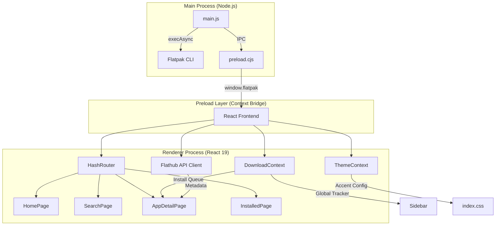

# Axelon Flatpak Store: Architecture Overview

The Axelon Flatpak Store is a production-ready, modern application built for Arch Linux. It combines the power of Electron for system-level integration with the speed and elegance of React 19 and Tailwind CSS v4.

## 🏗️ System Architecture

---

## 🚀 Key Components

### 1. Backend (Electron Main Process)
- **Path:** [electron/main.js](file:///home/andy/Downloads/app-store/electron/main.js)
- **Responsibility:** Managing the application window and handling high-privilege IPC calls.
- **IPC Handlers:** Executes shell commands (`flatpak install`, [uninstall](file:///home/andy/Downloads/app-store/electron/preload.cjs#7-8), [search](file:///home/andy/Downloads/app-store/electron/preload.cjs#4-5), `remote-info`) asynchronously and returns standardized JSON results to the frontend.
- **Native Integration:** Removes default menu bars and configures the environment for production builds using `electron-builder`.

### 2. IPC Bridge (Preload Script)
- **Path:** [electron/preload.cjs](file:///home/andy/Downloads/app-store/electron/preload.cjs)
- **Responsibility:** Exposing a secure, limited surface of `flatpak` commands to the React frontend via the `contextBridge`. This ensures the renderer never has direct access to `child_process` or `ipcRenderer`.

### 3. Frontend Architecture (React 19)
- **SPA Routing:** Uses `react-router-dom` with `HashRouter` for reliable navigation within the Electron environment.
- **Global State Management:**
    - **`DownloadContext`**: Manages a global queue of active and completed installations. Includes a "mock" progress simulation for responsive UI feedback.
    - **`ThemeContext`**: Handles user preference for accent colors (Violet, Emerald, Blue, Amber, Rose), dynamically updating CSS variables that Tailwind v4 consumes.
- **API Client ([flathub.js](file:///home/andy/Downloads/app-store/src/lib/flathub.js))**: Fetches rich metadata (screenshots, SVG icons, descriptions) from Flathub's v2 appstream API. Includes caching and in-flight request management.

### 4. UI/UX Layer
- **Tailwind CSS v4:** Leverages the latest CSS-only theme engine for high performance.
- **Glassmorphism Design:** Uses backdrop blurs, subtle borders, and low-opacity backgrounds to achieve a "premium" desktop feel.
- **Custom Components:** Reusable [AppIcon](file:///home/andy/Downloads/app-store/src/components/AppIcon.jsx#4-47), [Modal](file:///home/andy/Downloads/app-store/src/components/Modal.jsx#3-47), [Sidebar](file:///home/andy/Downloads/app-store/src/components/Sidebar.jsx#29-118), and [DownloadPanel](file:///home/andy/Downloads/app-store/src/components/DownloadPanel.jsx#34-121) ensure consistent design patterns throughout the app.
- **Animations:** Lightweight CSS animations (`fadeUp`, `pageEnter`, `zoomIn`) provide a fluid, responsive experience without taxing the CPU.

---

## 🛠️ Build & Packaging
- **`electron-builder`**: Configured to produce native `.AppImage` and `.deb` packages for Linux.
- **Vite**: Handles the fast transformation of JSX and modern CSS during development and builds.
